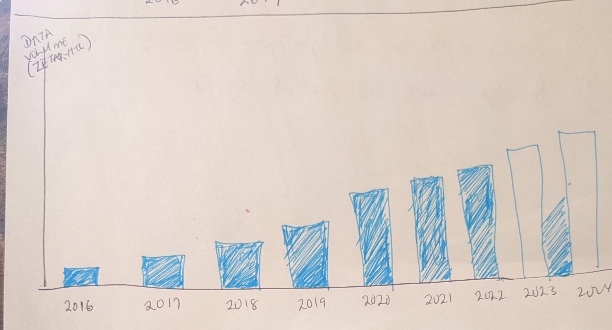
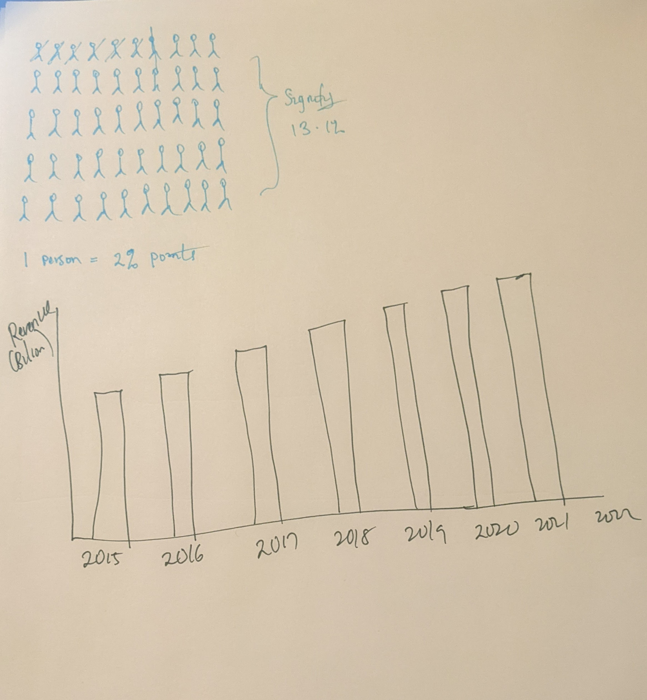

# Data Analytics and Heinz: Why you should Hire me / (Or why you should come to Heinz)

## Outline
The purpose of this project is to give a quick breakdown of my skills and reasons I think you shuld hire me. Additionally, I will quick review of the projects I have completed. My call to action will be "These are my skills. Hire me" (Or this is why you should come to Heinz).**Still unsure about direction of call to action here. Will decide based on how final version of project looks** 

Throughout the project, I will explore concepts like the percentage of people with a masters degree, how data analytics is helping people, and some action items that the audience might be interested in. I got inspired to do a topic from this standpoint mainly because it is job hunting season and putting ideas in your head in form of a story might help your audience (or in this case, potential employer).

Here’s an overview of the major elements of my story:

1). Talk about the percentage of people with a masters' degree

2). Talk a little bit about the developing field of data analytics
  Introdue some concepts and talk about some statstica facts such as:
  > The market survey report showed that the total amount of data being consumed globally was forecasted to increase rapidly to 64.2 zettabytes in 2020 and 79 zettabytes in 2021 while it is projected to grow to over 180 zettabytes up to 2025. It also reported that the installed base of storage capacity will increase at a compound annual growth rate of 19.2% from 2020 to 2025.
  > 
  >The Big Data and business analytics revenue report from Statista showed the forecast of the Big Data market that it will grow to US$274.3 billion by 2022 with a five-year CAGR of 13.2%. The global cloud data center IP traffic will reach almost 19.5 zettabytes in 2021

3). Programming languages popular in the field and percentage of people with skills in these languages

4). Move from three above to a personal view point and talk about your first project at Heinz and what you learnt. Next, talk about your second, third and fourth project. Impact metrics from all these projects and ways it can be applied.

5). Call to Action
> In this section, I will remind the audience about the importance of analytics in the coming years, the skills I have picked and the projects I have worked on will have an impact.

## Initial Sketches
1). Large amounts of data being consumed and how it is expected to grow
2). Forecast of the Big Data Market in terms of Revenue
3). Benefits of Big Data for Organizations (in terms of optimization/percentage terms for various organizations)
4). Percentage of epople with masters degree

## The Data

The data souces I wll use are:
1). Census American Community Survey (ACS) Data: This will be used to show the breakdown of people with a master's degree. Click [here](https://www.census.gov/library/stories/2019/02/number-of-people-with-masters-and-phd-degrees-double-since-2000.html)
2). Statista: This will be used to show the growth of data used over time and potential revenue. Click[here](https://www.statista.com/statistics/871513/worldwide-data-created/) and [here](https://www.statista.com/statistics/551501/worldwide-big-data-business-analytics-revenue/)
3). Personal githb portfolio project page

## Method and Medium
Method

I plan to draw out my actual storyboard to have an idea of what it look like. I will also build up some visualizations using Flourish and make little tweaks to my storyflow if needed.

Medium

I plan on using Shorthand for this project. I will use Shorthand to pull together text and visualizations into a coherent story. The headers within Shorthand will correspond to each of the major elements of my Storyboard, as outlined above.

## References
1 .United States Census Bureau (2019). _About 13.1 Percent Have a Master’s, Professional Degree or Doctorate_. https://www.census.gov/library/stories/2019/02/number-of-people-with-masters-and-phd-degrees-double-since-2000.html. Accessed February 12, 2022.

2. Statista (2021). _Volume of data captured worldwide_. https://www.statista.com/statistics/871513/worldwide-data-created/. Accessed February 13, 2022.

